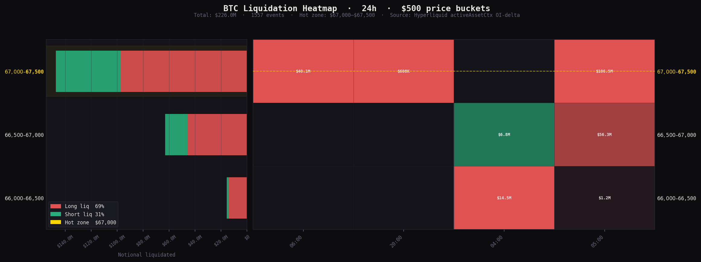

# hl-liquidation-heatmap

Realized BTC (ETH/SOL) liquidation heatmap for Hyperliquid perps.  
Price level (y) × time (x) · color = long/short dominant · intensity = notional.


> *2h capture · Asian session close (06:30–08:30 Paris) · 1,557 events · $226M notional*

## How it works

Hyperliquid exposes no liquidation flag on any public REST or WebSocket endpoint.  
After testing every available source:

| Source | Why it fails |
|--------|-------------|
| HL REST `userFillsByTime` | Returns empty for HLP vault |
| HL WebSocket `trades` | No `dir` or `liquidation` field |
| Dune free tier | No fills table; ad-hoc SQL is paid-only |
| Hydromancer S3 | Requester-pays, needs AWS credentials |
| HL official S3 | Needs AWS CLI + LZ4 decompress |

**Solution:** subscribe to `activeAssetCtx` (1s updates), detect open interest drops,  
infer liquidation price and notional from `markPx × OI_delta`. Chain-native, no auth required.

```
OI drops sharply + price moving → liquidation cascade at that price level
```

## Setup

```bash
pip install -r requirements.txt
cp env.example .env
```

## Usage

```bash
# 1 — start the streamer (background, auto-reconnects)
python stream.py --coins BTC,ETH,SOL

# Run as background daemon
nohup python stream.py --coins BTC,ETH,SOL > stream.log 2>&1 &

# 2 — render heatmap from captured data
python main.py --coin BTC --days 1
python main.py --coin BTC --days 1 --output btc.png && open btc.png
```

Leave the streamer running during volatile sessions. 1h of data gives  
meaningful price-level clustering. Asian session close (00:00–02:00 UTC)  
and EU open (07:00–09:00 UTC) tend to be most active.

## Structure

```
hl-liquidation-heatmap/
├── stream.py       # WebSocket daemon — OI-delta inference → SQLite
├── main.py         # CLI entrypoint
├── fetcher.py      # DB helpers
├── processor.py    # Price bucketing + heatmap matrix
├── visualizer.py   # Matplotlib dark-theme renderer
└── requirements.txt
```

## Signal quality

OI-delta inference captures both market and backstop liquidations.  
False positives (large voluntary closes) are possible in calm markets;  
during cascades the signal is clean. Threshold tuning in `stream.py`:

```python
MIN_DROP = {"BTC": 0.01, "ETH": 0.1, "SOL": 1.0}  # coin units
```
